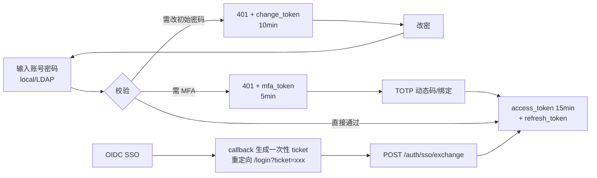

# 数据模型与认证体系

<cite>
**参考文件**
- [backend/app/models/](file://backend/app/models/)
- [backend/app/core/constants.py](file://backend/app/core/constants.py)
- [backend/app/services/auth_service.py](file://backend/app/services/auth_service.py)
- [docs/03-数据库设计.md](file://docs/03-数据库设计.md)
- [docs/04-API设计.md](file://docs/04-API设计.md)
</cite>

## 目录
1. [数据模型总览（27 张表）](#数据模型总览27-张表)
2. [认证登录流程](#认证登录流程)
3. [四种令牌](#四种令牌)
4. [RBAC 权限体系（20 权限点）](#rbac-权限体系20-权限点)
5. [API 错误码约定](#api-错误码约定)

## 数据模型总览（27 张表）

按领域文件划分（`backend/app/models/`）：

| 领域文件 | 表数 | 表名 |
| --- | :---: | --- |
| auth.py | 6 | user / role / permission / user_role / role_permission / api_token |
| cmdb.py | 3 | host / application / app_host |
| job.py | 5 | credential / ticket_template / template_step / template_approval_node / template_version |
| ticket.py | 4 | ticket / ticket_host / ticket_step / ticket_approval |
| execution.py | 3 | execution / execution_step / execution_step_host |
| audit.py | 2 | audit_log（按天分区）/ system_config |
| notify.py | 4 | notify_channel / notify_channel_event / notification_record / user_notification |

迁移链：Alembic 0001~0006；种子数据（[seed.py](file://backend/app/services/seed.py)）：
20 权限点、4 内置角色、admin 用户、9 个系统配置键、6 个通知渠道、18 条事件映射。

## 认证登录流程

- 三条认证通道由 [auth_providers/](file://backend/app/auth_providers/)（local/ldap/oidc）策略模式实现；LDAP/OIDC 首次登录自动建号并赋默认角色（`ldap.default_role` / `oidc.default_role`）。
- MFA 三态管控：系统策略 `mfa.policy` + 用户级 enable/disable/reset（`user:mfa` 权限，默认仅 admin）。

## 四种令牌

| 令牌 | 默认时效 | 环境变量 | 用途 |
| --- | --- | --- | --- |
| access_token | 15 分钟 | `ACCESS_TOKEN_MINUTES` | 业务 API 访问，过期由 refresh 静默续期 |
| refresh_token | 7 天 | `REFRESH_TOKEN_DAYS` | 换新 access，决定"多久不用需重登" |
| mfa_token | 5 分钟 | `MFA_TOKEN_MINUTES` | MFA 中间态，仅可提交动态码/绑定认证器 |
| change_token | 10 分钟 | `PWD_CHANGE_TOKEN_MINUTES` | 强制改密中间态，仅可调改密接口 |

另有**个人 API Token**（`api_token` 表，个人中心自助管理），供脚本化调用。
运行期令牌策略以页面配置 `token.policy` 优先。

## RBAC 权限体系（20 权限点）

权限点全集定义于 [constants.py](file://backend/app/core/constants.py) `PERMISSIONS`，
覆盖 user/role/host/app/credential/template/ticket/execution/audit/system/notify 资源的
read/write 组合，外加特殊权限 `user:mfa`（MFA 管控，默认仅 admin）。
内置 4 角色；角色-权限可页面自定义组合。API 层通过依赖注入声明权限（[deps.py](file://backend/app/core/deps.py)）。

## API 错误码约定

- 统一响应包络：`{code, message, data}`，`code=0` 成功。
- 认证中间态错误码走 **HTTP 401**：`40103`（需 MFA）、`40104`（需绑定 MFA）、`40105`（需改初始密码），
  data 中携带对应临时令牌。
- 完整错误码表与接口契约见 [docs/04-API设计.md](file://docs/04-API设计.md)；
  运行时以 OpenAPI `/api/v1/docs` 为最终契约。

**Sources** · [backend/app/services/auth_service.py](file://backend/app/services/auth_service.py) · [backend/app/core/constants.py](file://backend/app/core/constants.py)
