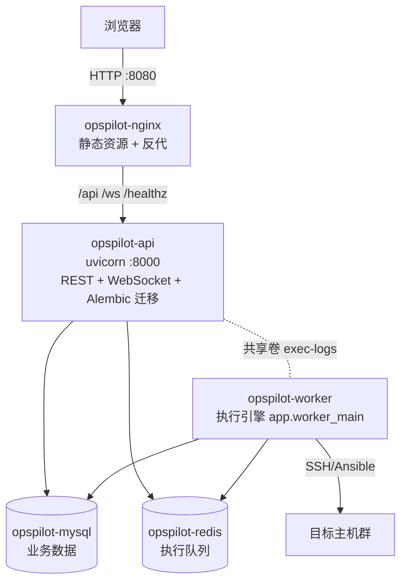

# 系统架构

<cite>
**参考文件**
- [deploy/docker-compose.yml](file://deploy/docker-compose.yml)
- [deploy/nginx.conf](file://deploy/nginx.conf)
- [backend/app/main.py](file://backend/app/main.py)
- [backend/app/worker_main.py](file://backend/app/worker_main.py)
- [docs/02-技术架构设计.md](file://docs/02-技术架构设计.md)
</cite>

## 目录
1. [技术栈](#技术栈)
2. [部署拓扑](#部署拓扑)
3. [后端分层架构](#后端分层架构)
4. [执行引擎架构](#执行引擎架构)
5. [关键架构决策](#关键架构决策)

## 技术栈

| 层 | 选型 |
| --- | --- |
| 后端 | Python 3.11 + FastAPI + SQLAlchemy(async) + Alembic + asyncssh |
| 前端 | Vue3 + TypeScript + Vite + Ant Design Vue 4.x + Pinia |
| 存储 | MySQL 8.0（utf8mb4，业务数据）+ Redis 7（队列/缓存，AOF 持久化） |
| 部署 | Docker Compose 五容器单机部署，nginx 1.27 反向代理 |

## 部署拓扑



- **仅 nginx 对外暴露端口**；mysql/redis/api 不映射宿主机端口。
- 启动依赖链：mysql+redis(healthy) → api(healthy，启动时执行 `alembic upgrade head`) → worker、nginx。
- api 与 worker **共用同一镜像**，以不同 command 启动；仅 api 执行迁移（`RUN_MIGRATIONS=1`），worker 等 api 健康后启动，天然避免并发迁移。

**Sources** · [deploy/docker-compose.yml](file://deploy/docker-compose.yml) · [backend/docker-entrypoint.sh](file://backend/docker-entrypoint.sh)

## 后端分层架构

```
app/
├── api/v1/          # 路由层：15 个路由文件，只做参数校验与权限声明
├── services/        # 业务层：15 个 service，事务边界所在
├── models/          # ORM 层：8 个领域文件，共 27 张表
├── schemas/         # Pydantic 请求/响应模型
├── core/            # 框架核心：config/security/deps/response/constants/database/redis
├── engine/          # 执行引擎：pipeline/ssh_runner/ansible_runner/control/logs/events/recovery
├── auth_providers/  # 认证提供方：local/ldap/oidc 策略模式
├── notify/          # 通知渠道：email/webhook/teams + dispatcher
└── audit/           # 审计：writer（异步落库）+ partition（分区管理）
```

统一响应包络 `{code, message, data}`（code=0 成功），业务异常经 `BizError` 携带业务错误码与 HTTP 状态码。

**Sources** · [backend/app/core/response.py](file://backend/app/core/response.py)

## 执行引擎架构

- **任务分发**：工单审批通过后入 Redis 队列，worker 消费；全局 SSH 并发信号量（默认 50，页面可调 `exec.global_concurrency`）。
- **Pipeline**：多步骤顺序执行（Shell 走 asyncssh 直连；Playbook 走 Ansible 作业主机），单步内按主机并发 + 可分批 + 批间确认。
- **执行控制**：暂停/恢复/中止/强制中止，控制信号经 Redis 传递（[control.py](file://backend/app/engine/control.py)）。
- **实时日志**：执行日志落盘共享卷 `/data/logs`，WebSocket 推送（nginx `/ws/` 3600s 超时）。
- **崩溃恢复**（[recovery.py](file://backend/app/engine/recovery.py)）：worker 重启后 queued 任务重认领重跑；running/paused 任务标 `interrupted` 并记录原因，需人工重新发起。

## 关键架构决策

| 决策 | 理由 |
| --- | --- |
| api/worker 共镜像分进程 | 复用依赖与代码，简化构建；执行阻塞不影响 API 响应 |
| 仅 api 跑 Alembic 迁移 | 避免多容器并发迁移竞态（冲突声明 C4） |
| nginx.conf 挂载覆盖镜像兜底配置 | 改反代配置免重建镜像（冲突声明 C3） |
| Redis AOF 开启 | 执行队列消息不因容器重启丢失 |
| 审计日志按天分区 | 365 天保留策略下删除过期数据 = drop 分区，避免大表 DELETE |
| 敏感字段 AES-256-GCM 加密 | MFA secret 与 SSH 凭据落库前加密，主密钥 `SECRET_ENCRYPT_KEY` |

**Sources** · [docs/02-技术架构设计.md](file://docs/02-技术架构设计.md)
