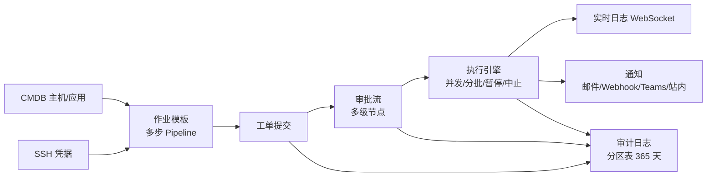

# OpsPilot V1 精简版 · 项目概述

<cite>
**参考文件**
- [README.md](file://README.md)
- [docs/01-PRD.md](file://docs/01-PRD.md)
- [docs/05-开发任务拆解.md](file://docs/05-开发任务拆解.md)
</cite>

## 目录
1. [项目定位](#项目定位)
2. [核心业务流](#核心业务流)
3. [功能模块清单](#功能模块清单)
4. [项目状态](#项目状态)
5. [代码仓库结构](#代码仓库结构)

## 项目定位

OpsPilot V1 是一个**面向单机 Docker Compose 内网部署的自动化运维平台**，
核心价值链：CMDB（主机/应用）→ 作业模板（Shell / Ansible Playbook 多步 Pipeline）→
工单审批 → 并发执行（实时日志/执行控制）→ 通知（邮件/Webhook/Teams）→ 全链路审计。

- 规模约束：500 台并发执行已实测通过（端到端 65.1s，列表接口 P95 全部 < 500ms）
- 部署形态：五容器（nginx / api / worker / mysql / redis），仅 nginx 对外暴露端口（默认 8080）

## 核心业务流



## 功能模块清单

| 模块 | 能力要点 |
| --- | --- |
| 认证与 RBAC | 本地/LDAP/OIDC 三通道登录、强制 MFA(TOTP)、首登改密、20 权限点 × 4 内置角色、个人 API Token |
| CMDB | 主机管理（Excel 批量导入 ≤5000 行）、应用管理（多对多关联主机） |
| 作业模板 | Shell/Playbook 多步 Pipeline、执行策略（并发/分批/超时/失败策略）、审批节点、通知规则、模板版本化 |
| 工单中心 | 模板化提单、多级审批、撤回、创建时间筛选 |
| 执行中心 | 并发执行（全局信号量默认 50）、分批+批间确认、暂停/恢复/中止/强制中止、WebSocket 实时日志、Worker 崩溃恢复 |
| 通知 | 邮件/Webhook/Teams 渠道 + 站内通知、渠道消息模板、事件订阅 |
| 审计 | 全链路操作审计、按天分区表、保留 365 天自动清理 |
| 系统设置 | MFA/令牌/密码策略、LDAP/OIDC 配置、Ansible 作业主机、全局并发、凭据管理 |
| 工作台 | 汇总卡片（按权限裁剪）+ 工单趋势图（日/周/月/年粒度） |
| 全局搜索 | 顶栏跨模块搜索 |

## 项目状态

**V1 已竣工**：M0~M8 全部里程碑完成 + 9 项增量任务（INC-01~09），
设计文档五篇均为竣工口径（as-built，与代码同步），见 [docs/](file://docs/)。
运行时 API 最终契约以 OpenAPI（`/api/v1/docs`）为准。

## 代码仓库结构

```
backend/    FastAPI 应用（api 与 worker 共用镜像，入口不同）
frontend/   Vue3 + TS 前端（构建产物打进 nginx 镜像）
deploy/     compose 编排 / nginx.conf / 备份与离线脚本 / 压测设施 / 生产部署手册
docs/       竣工设计文档（PRD、技术架构、数据库、API、任务拆解）
```

**Sources** · [README.md](file://README.md) · [docs/05-开发任务拆解.md](file://docs/05-开发任务拆解.md)
