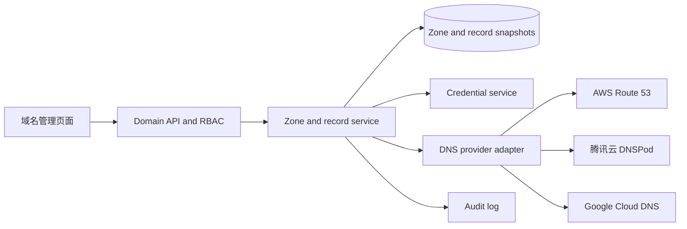

# 域名管理与 DNS 一期实施设计

## 1. 状态与范围

| 项目 | 内容 |
| --- | --- |
| 状态 | 实施细节已确认；等待规格审阅与实施授权 |
| 目标 | 建立以 DNS Zone 为台账对象的域名管理模块，并直接管理腾讯云 DNS、AWS Route 53、Google Cloud DNS 的公网解析记录 |
| 管理边界 | Zone 是唯一资产对象；服务商是最终事实来源；平台保存可手动刷新的本地快照 |
| 当前实际环境 | 全部现有 DNS 在 AWS Route 53，使用 IAM Access Key；一期仍完成三家服务商真实 API 适配 |

本设计仅覆盖一期 DNS Zone 台账与解析管理。所有写操作由具备授权的用户在模块内直接执行，不接入工单审批。

不在一期范围内：注册商、续费、到期提醒、证书生命周期、应用关联、私有 Zone、自动或定时同步、WebHook 变更通知、远端 Zone 的创建和删除、解析记录 Excel 导入、批量解析变更、Route 53 Alias 的编辑、高级路由策略、DNS 记录内容的顶栏搜索。

## 2. 已确认的业务决策

1. DNS Zone 是一期唯一的资产台账对象，不建立注册域名资产表，也不关联现有应用资产。
2. 每个 Zone 绑定一个服务商、一个远端 Zone ID 和一个已有凭据；同一凭据可以被多个 Zone 使用。
3. 支持腾讯云 DNS（DNSPod）、AWS Route 53、Google Cloud DNS 三家服务商。用户先选择服务商和凭据，平台拉取可访问的 Zone，过滤私有 Zone 后由用户勾选绑定。
4. 绑定成功时立即完整同步既有 DNS 记录。之后仅由用户手动同步；平台新增、修改、删除记录成功后立即再次同步。
5. 服务商后台是最终事实来源。允许在后台手工修改；平台写入前必须读取远端并与快照比较，发现差异时拒绝写入并提示先同步。
6. 记录集是最小编辑单位。一个记录集保存 TTL 和全部值，编辑时整体替换，防止误删同名同类型的其他值。
7. 平台只写简单路由的 `A`、`AAAA`、`CNAME`、`MX`、`TXT`、`CAA`、`SRV` 记录集。所有 `SOA`、`NS`、Route 53 Alias、高级路由及其他类型只读展示。
8. 新建记录 TTL 默认 300 秒；可写记录统一限制为 300 到 86400 秒。同步到 TTL 超出范围的已有记录保留展示，但只读。
9. 记录所有权名称支持 `@`、相对名称和完整域名；后端统一规范化为 Zone 内完整名称。记录值使用多行原始文本，一行一个值，由后端按类型校验。
10. 新增、修改和删除均先展示变更前后对比，用户确认后才调用服务商 API。
11. 远端写入成功而后续同步失败时不回滚远端，保留旧快照并标记同步失败；分别记录远端写入成功和同步失败审计。
12. Zone 列表包含本地“描述”字段，可单独编辑，远端同步不覆盖该字段。
13. Excel 仅导入 Zone 台账。导入必填服务商、凭据名称、Zone 名称、远端 Zone ID；已绑定 Zone 跳过，不更新描述或触发重复同步。
14. Zone 导出包含 Zone 台账和记录集两个工作表；全局搜索仅按 Zone 名称、描述和服务商匹配，不搜索记录名称或记录值。
15. DNS 审计完整保存所有记录类型的变更前后值，包括 `TXT`；凭据原文、加密内容和服务商访问密钥永不写入接口、审计或日志。

## 3. 当前系统约束与接入原则

当前 CMDB 只有 `host`、`application`、`app_host` 和 `job_host`，没有域名、DNS 或证书实体。域名模块必须独立建模，不能向主机、应用或工单模板表追加 DNS 字段。

已有 `credential` 表已使用 AES-256-GCM 加密 `secret_enc`，读取接口和审计均不返回密文。DNS 模块只保存 `credential_id`，在服务端执行时短暂解密并传入适配器。凭据类型复用规则如下：

| 服务商 | 现有凭据类型 | `login_user` | `secret` / 文件内容 |
| --- | --- | --- | --- |
| AWS Route 53 | `username_password` | IAM Access Key ID | Secret Access Key |
| 腾讯云 DNS（DNSPod） | `username_password` | SecretId | SecretKey |
| Google Cloud DNS | `secret_file` | 空 | Service Account JSON |

DNS 模块只通过专用受限接口返回兼容凭据的 ID、名称、类型和说明。拥有 `domain:write` 即可使用该接口，无需获得现有 `secret:read`；接口绝不返回密文或明文。凭据删除时必须新增 Zone 引用保护。

数据库不建立物理外键，沿用当前应用层校验、索引和删除保护约定。当前产品文档描述的是已实现能力，因此本设计文件是一期唯一的预实施文档；实际实现后再同步 `docs/` 中的产品、数据库、API、架构和任务文档。

## 4. 总体架构



适配器只处理服务商 API、认证对象和标准化数据转换；领域服务负责凭据解密、权限、Zone 操作租约、快照替换、远端冲突检测、审计和业务错误转换。服务商 SDK 调用使用 `asyncio.to_thread` 运行，不能阻塞 FastAPI 事件循环，也不能在日志中输出 SDK 请求、凭据或完整 HTTP 头。

新增一个适配器契约，包含：

```text
discover_public_zones(credential)
list_record_sets(zone, credential)
get_record_set(zone, record_key, credential)
create_simple_record_set(zone, record, credential)
replace_simple_record_set(zone, before, after, credential)
delete_simple_record_set(zone, before, credential)
```

适配器返回统一的 Zone 与记录集对象。服务商私有字段进入 `provider_meta`，不得泄露访问密钥。AWS 通过 `PrivateZone=false`、Google Cloud 通过 `visibility=public` 过滤私有 Zone；腾讯云接入 DNSPod 公网解析 API，不接入 Private DNS API。

一期使用官方 SDK：`boto3`、`tencentcloud-sdk-python`、`google-cloud-dns`。Google Service Account JSON 在内存中解析为凭据对象，不写入临时文件。

## 5. 领域模型与数据库

### 5.1 `dns_zone`

`dns_zone` 是 Zone 台账和同步状态实体。

| 字段 | 说明 |
| --- | --- |
| `id` | `BIGINT UNSIGNED` 主键 |
| `provider` | `tencent_dnspod`、`aws_route53`、`google_cloud_dns` |
| `remote_zone_id` | 服务商返回的稳定 Zone 标识；与服务商组合唯一 |
| `zone_name` | 规范化后的 Zone 名称，无尾点，用于展示和查询 |
| `credential_id` | 已有凭据 ID，应用层校验且建立索引 |
| `description` | 本地说明，最大 255 字符，远端同步不覆盖 |
| `record_count` | 最近一次成功同步的记录集数 |
| `sync_status` | `success`、`failed`、`syncing` |
| `last_synced_at` | 最近一次完整成功同步时间 |
| `last_sync_error` | 经脱敏后的最近失败摘要 |
| `operation_token` / `operation_kind` / `operation_expires_at` | 数据库操作租约，串行化同一 Zone 的同步和写操作 |
| `created_by`、`created_at`、`updated_at` | 创建人与时间审计字段 |

唯一约束为 `(provider, remote_zone_id)`，不按 Zone 名称唯一。Route 53 等服务商允许存在同名 Zone，因此 Excel 导入和绑定都以远端 Zone ID 定位。

### 5.2 `dns_record_set`

一行对应一个规范化记录集，存放最近成功同步的快照。

| 字段 | 说明 |
| --- | --- |
| `id` | `BIGINT UNSIGNED` 主键 |
| `zone_id` | 所属 `dns_zone.id`，建立索引 |
| `record_key` | 适配器生成的 Zone 内稳定键；简单记录由规范化名称和类型组成，复杂记录附带服务商路由标识 |
| `record_name` / `record_type` | 规范化完整记录名与类型 |
| `ttl` | 秒；Alias 等无 TTL 的记录可为空 |
| `values` | JSON 字符串数组，一项对应编辑表单的一行 |
| `read_only` / `read_only_reason` | 标记系统记录、NS、Alias、高级路由、未支持类型或超范围 TTL 等只读原因 |
| `provider_meta` | 服务商记录 ID、路由键、Alias/高级策略等非敏感元数据 |
| `created_at`、`updated_at` | 快照写入与更新时刻 |

`(zone_id, record_key)` 唯一。服务商不一定原生提供记录集 ID，例如 Route 53 以名称、类型和路由标识定位；因此 `record_key` 由适配器稳定生成，不能依赖前端拼接。

迁移 `0019_domain_management.py` 在 `0018` 后创建两张表及索引。由于新库可能先由最新 ORM 元数据建表，迁移必须使用 `information_schema` 检查表和字段是否已存在，避免新部署升级时报重复建表。

## 6. 同步、一致性与失败语义

### 6.1 Zone 发现与绑定

1. 用户选择服务商与兼容凭据。
2. 服务端解密凭据、调用适配器并返回可访问的公网 Zone；凭据错误或权限不足返回脱敏后的 `42201`。
3. 用户勾选 Zone 后提交远端 Zone ID。服务端再次校验 Zone 仍可访问、仍是公网 Zone，且尚未绑定。
4. 服务端完整同步全部远端分页记录；只有同步成功后，才在本地创建 Zone 和记录集快照。
5. 初次同步失败则绑定失败且不持久化 Zone；批量绑定或 Excel 导入返回逐项失败原因。

解绑仅删除本地 Zone、记录集快照和绑定关系，不调用服务商删除远端 Zone 或记录。

### 6.2 手动同步

同一 Zone 的同步与写操作通过数据库条件更新获取短期操作租约。租约存在且未过期时返回 `40901`，避免并发同步、重复删除或一个用户用旧快照覆盖另一用户的更新。服务商调用不持有长数据库事务；租约超时可由后续请求安全回收。

同步流程：

1. 获取 Zone 操作租约并标记 `syncing`。
2. 拉取所有远端分页记录，规范化记录名称、记录值、TTL 和服务商元数据，判定只读原因。
3. 只有全部分页读取成功后，才在一个本地事务中 upsert 新快照、删除远端已不存在的快照、更新 `record_count`、`last_synced_at` 和成功状态。
4. 任一读取、限流或分页失败时不改记录集快照，保留旧数据，更新失败状态和脱敏错误摘要。
5. 成功或失败均写入 `domain.zone.sync` 审计。

发现和同步仅对明确的临时网络错误作有限重试；写操作不自动重试，避免网络结果未知时重复提交远端变更。

### 6.3 记录集写入

新增、修改、删除统一执行以下顺序：

1. 校验调用者权限、Zone 状态、记录类型、只读标记、TTL 和值格式，获取 Zone 操作租约。
2. 调用服务商读取当前远端记录集，并与本地快照的规范化内容比较。新增要求远端不存在；修改和删除要求远端完整匹配快照。
3. 远端发生后台手工变更、删除或新增时返回 `40901`，不执行写入，提示用户先同步。
4. 调用适配器写入远端；成功后立即执行完整 Zone 同步。
5. 远端写入与同步都成功时更新快照并写成功审计。
6. 远端写入成功而同步失败时不回滚远端，保留旧快照并标记同步失败；分别写入记录变更成功和同步失败审计。

服务商返回认证失败、权限不足或参数被拒绝时转换为 `42201`；远端暂时不可用、超时或限流转换为新增业务码 `50201`；本地参数错误、只读记录和不支持的路由策略使用 `40001` 或 `42201`；所有错误消息必须移除凭据、签名、Token、HTTP 头和原始 SDK 请求信息。

## 7. 记录输入、规范化与只读规则

记录表单的“记录值”使用多行文本，一个非空行代表一个记录值。仅所有权名称允许 `@`、相对名称和完整域名；相对名称自动拼接当前 Zone，完整所有权名称必须在当前 Zone 范围内。CNAME、MX、SRV 等目标值不自动追加 Zone，以保留 DNS 原始语义。

| 类型 | 后端校验 |
| --- | --- |
| `A` | 每行必须是 IPv4 地址 |
| `AAAA` | 每行必须是 IPv6 地址 |
| `CNAME` | 仅允许一行、合法域名目标 |
| `MX` | 每行 `优先级 目标`，优先级为 0 到 65535 |
| `SRV` | 每行 `优先级 权重 端口 目标`，前三项为 0 到 65535 |
| `TXT` | 每行一个文本值，按服务商长度和转义规则校验并保存规范化结果 |
| `CAA` | 每行 `flags tag value`，`flags` 为 0 到 255，标签和值符合 RFC 格式 |

多值记录的比较以规范化后的集合为准，避免服务商仅重排序造成假冲突；审计保留用户提交与服务端规范化后的完整前后值。已有的 `SOA`、所有 `NS`、Alias、高级路由、未支持类型和 TTL 不在可写范围的记录都显示为只读，前端不提供编辑或删除入口，服务端仍做最终拒绝。

## 8. 权限、凭据与审计

新增独立权限点：

| 权限 | 行为 |
| --- | --- |
| `domain:read` | 查看 Zone、同步快照、记录集、完整 TXT 值及 Zone 导出 |
| `domain:write` | 获取兼容凭据元数据、发现 Zone、绑定、编辑描述、手动同步、新增和修改记录集、Zone 台账导入 |
| `domain:delete` | 解绑 Zone、删除记录集 |

只有内置 `admin` 默认拥有这三个权限；`ops`、`approver`、`auditor` 不默认获得。角色管理可以向自定义或内置可编辑角色按需授予。前端菜单、路由和按钮按权限隐藏，后端每个接口仍使用 `require_perm` 验证。

凭据删除保护扩展为：任一 `dns_zone.credential_id` 引用凭据时，删除返回 `42201` 并显示受影响 Zone 数量。DNS 绑定不改变凭据类型，凭据轮换后下一次发现、同步或写操作自动使用最新密文。

审计模块使用 `domain`，动作至少包含：

```text
zone.discover zone.bind zone.update zone.sync zone.unbind
record.create record.update record.delete
```

审计记录操作者、来源 IP、服务商、Zone、结果和失败摘要。记录变更详情保存完整 `before`、`after`、TTL、值和远端结果，包括 `TXT`；凭据 ID 可以记录，但 Access Key、Secret、Service Account JSON、加密内容、签名、请求头和 SDK 原始异常不得记录。

## 9. API、Excel、搜索与前端

### 9.1 API

新增 `/domains` 路由，静态子路径必须在 `/{zone_id}` 前声明。

| 方法 | 路径 | 权限 | 说明 |
| --- | --- | --- | --- |
| GET | `/domains/zones` | `domain:read` | 分页、关键词、服务商、同步状态筛选 |
| GET | `/domains/zones/{zone_id}` | `domain:read` | Zone 详情和同步摘要 |
| PUT | `/domains/zones/{zone_id}` | `domain:write` | 仅更新本地描述 |
| DELETE | `/domains/zones/{zone_id}` | `domain:delete` | 解绑，仅删本地快照 |
| GET | `/domains/credentials` | `domain:write` | 按服务商返回兼容凭据安全元数据 |
| POST | `/domains/zones/discover` | `domain:write` | 按服务商与凭据发现公网 Zone |
| POST | `/domains/zones` | `domain:write` | 批量绑定用户勾选的已有 Zone，并逐项初次同步 |
| POST | `/domains/zones/{zone_id}/sync` | `domain:write` | 手动完整同步 |
| GET | `/domains/zones/{zone_id}/records` | `domain:read` | 记录集分页、名称、类型和只读状态筛选 |
| POST | `/domains/zones/{zone_id}/records` | `domain:write` | 新增简单路由记录集 |
| PUT | `/domains/zones/{zone_id}/records/{record_id}` | `domain:write` | 修改简单路由记录集 |
| DELETE | `/domains/zones/{zone_id}/records/{record_id}` | `domain:delete` | 删除简单路由记录集 |
| GET | `/domains/zones/import-template` | `domain:write` | 下载 Zone 台账导入模板 |
| POST | `/domains/zones/import` | `domain:write` | Zone 台账 Excel 逐行导入 |
| GET | `/domains/zones/export` | `domain:read` | 导出 Zone 和记录集快照 |

新增全局搜索 `domains` 段。`GET /search` 在拥有 `domain:read` 时按 Zone 名称、描述和服务商返回最多 5 条及真实总数；无权限时该段为 `null`。前端结果点击进入 `/domains/{id}`，不携带记录筛选。

### 9.2 Excel

导入模板工作表为“Zone 导入”，列顺序如下：

```text
服务商* | 凭据名称* | Zone 名称* | 远端 Zone ID* | 描述
```

导入按“服务商 + 凭据名称”分组发现公网 Zone，逐行校验远端 Zone ID、Zone 名称、凭据类型和可访问性。已绑定 Zone 和文件内重复 Zone 均计为跳过；私有 Zone、不可访问 Zone、名称与 ID 不匹配、初次同步失败和不兼容凭据计为失败。单次导入上限沿用现有 5000 行，返回成功、跳过和失败行号及原因。

导出包含两个只读工作表：

- “Zone 台账”：服务商、凭据名称、Zone 名称、远端 Zone ID、描述、记录数、同步状态、最近同步时间和错误摘要。
- “记录集”：Zone 名称、服务商、记录名称、类型、TTL、值、只读原因和最近同步时间。

导出不包含凭据密文或明文；按用户已确认的审计边界，记录集工作表保留完整 TXT 值。

### 9.3 前端页面

新增以下前端边界，沿用现有 Ant Design Vue 列表、弹窗、抽屉、权限按钮、Excel 导入结果和表格列宽风格：

| 页面或模块 | 设计 |
| --- | --- |
| `DomainList.vue` | Zone 列表，展示名称、服务商、绑定凭据、描述、记录数、同步状态和最近同步时间；提供筛选、描述编辑、绑定、导入、导出和解绑 |
| `DomainDetail.vue` | 独立 Zone 详情页，展示描述、同步摘要和记录集表；提供手动同步、记录筛选、新增、编辑和删除 |
| Zone 绑定弹窗 | 选择服务商与凭据，加载并过滤公网 Zone，支持多选绑定，逐项显示同步结果 |
| 记录编辑弹窗 | 输入所有权名称、类型、TTL 和多行值；提交后打开变更对比确认弹窗 |
| 变更确认弹窗 | 新增显示将创建内容，修改显示 TTL 和全部值差异，删除显示完整待删除记录集；确认后锁定提交按钮并展示加载状态 |
| 全局搜索 | 新增“域名 Zone”结果组，仅显示名称、服务商和描述摘要 |

侧边栏增加“域名管理”入口，路由为 `/domains` 和 `/domains/:id`，由 `domain:read` 控制。SOA、NS、Alias、高级路由、未支持类型和超范围 TTL 记录标记只读，不显示编辑或删除按钮。

## 10. 实施文件与文档影响

预计新增：

```text
backend/app/models/domain.py
backend/app/schemas/domain.py
backend/app/services/domain_service.py
backend/app/services/domain_excel.py
backend/app/dns_providers/__init__.py
backend/app/dns_providers/base.py
backend/app/dns_providers/aws_route53.py
backend/app/dns_providers/tencent_dnspod.py
backend/app/dns_providers/google_cloud_dns.py
backend/app/api/v1/domains.py
backend/alembic/versions/0019_domain_management.py
backend/tests/test_domain_api.py
backend/tests/test_dns_providers.py
frontend/src/api/domain.ts
frontend/src/views/domain/DomainList.vue
frontend/src/views/domain/DomainDetail.vue
```

预计修改：

```text
backend/app/models/__init__.py
backend/app/api/v1/__init__.py
backend/app/core/constants.py
backend/app/core/response.py
backend/app/services/credential_service.py
backend/app/services/search_service.py
backend/requirements.txt
backend/tests/test_search_api.py
backend/tests/test_rbac_api.py
frontend/src/router/index.ts
frontend/src/layouts/BasicLayout.vue
frontend/src/api/search.ts
```

实现完成后同步更新：`docs/01-产品需求文档PRD.md`、`docs/02-技术架构设计.md`、`docs/03-数据库设计.md`、`docs/04-API设计.md`、`docs/05-开发任务拆解.md`，以及必要的部署说明。现阶段不修改这些“当前实现”文档。

## 11. 测试与验收

### 11.1 自动化验证

1. 适配器契约测试：三家服务商的公网 Zone 过滤、分页、记录集规范化、只读识别、创建、替换、删除和错误转换；使用伪 SDK 或 Mock，不使用真实密钥。
2. API 测试：独立权限、默认内置角色、受限凭据选择、Zone 发现/绑定/解绑、描述更新、初次同步失败不落库、手动同步、操作租约、远端漂移冲突、写入后同步失败语义。
3. 记录测试：所有可写类型校验、`@`/相对/FQDN 所有权名称规范化、TTL 边界、CNAME 单值、只读记录拒绝、完整变更审计。
4. 凭据保护测试：绑定 Zone 的凭据不可删除，轮换同一凭据后下一次适配器调用读取最新密文。
5. Excel 测试：模板列、远端 Zone ID 校验、成功/跳过/失败行、私有 Zone 拒绝、导出两个工作表和完整记录值。
6. 搜索测试：`domain:read` 用户只按 Zone 名称、描述、服务商命中；无该权限时 `domains` 段为 `null`。
7. 前端运行 `npm.cmd run type-check` 与 `npm.cmd run build`，验证路由、权限可见性、表单、确认弹窗、导入结果和深链接。

### 11.2 运行验收

1. 在隔离 Docker Compose 环境执行 `alembic upgrade head`，确认新旧数据库均可完成迁移，API 和 Worker 健康检查通过。
2. 为 AWS、腾讯云、Google Cloud 各准备独立非生产公网测试 Zone 与最小权限凭据。分别验证发现、绑定、已有记录同步、新增、修改、删除、后台外部改动冲突、手动同步和解绑。
3. 真实云端验收只操作测试记录，结束后删除本次创建记录；不得以生产解析记录验证写操作。
4. 比对最终改动文件与本设计第 10 节，确认不改动工单、执行、应用关联、私有 DNS 或证书等一期外能力。

## 12. 实施授权后的完成标准

一期完成需同时满足：

1. 管理员可使用三家服务商的已有公网 Zone，完成发现、绑定、同步、查看、导入和导出。
2. 授权用户能在直接确认后安全管理支持的简单记录集，系统可识别外部漂移并保护只读记录。
3. Zone 快照、同步状态、错误、凭据删除保护、角色权限、全局搜索和审计行为均符合本设计。
4. 审计包含完整记录变更值但不包含任何云凭据；所有写入与同步失败都可追溯。
5. 自动化测试、前端检查、迁移验证和三家服务商的非生产真实验收均通过。
